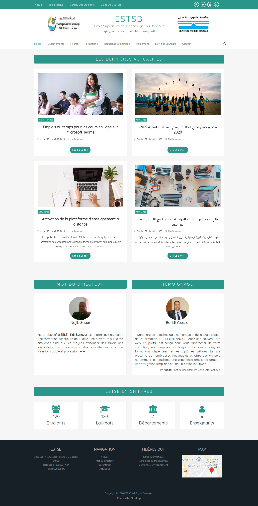

# Steduty
> A clean, responsive and simple WordPress theme for schools

## About Steduty

* Theme Name: Steduty
* Theme URI: https://github.com/Yassine-Lafryhi/Steduty
* Version: 1.0.0
* Tested up to: WordPress 5.3.2

Steduty is a powerful and versatile WordPress theme with pixel perfect design and outstanding functionality. It is by far the most advanced free WordPress theme available today for schools with loads of unmatched customization options.

## Built With
* [Bootstrap](https://getbootstrap.com/)
* [FontAwesome](https://fontawesome.com/)
* [Animate.css](https://daneden.github.io/animate.css/)

## Demo
You can try a live preview for the Steduty theme from here :
http://estsb-gi.atwebpages.com/

## Screenshots

## Theme Features

+ Bootstrap 4 integration
+ Responsive design
+ Unlimited color variations
+ SEO friendly
+ WordPress Theme Customizer support
+ Drop-down Menu
+ Font Awesome icons

## Installation

You can download Steduty theme from the releases tab.
Once you have **Steduty.zip** downloaded you can go to your **WordPress dashboard -> Appearance-> Themes-> Add New ->Upload Theme** and upload the previously downloaded file. Once installed you can click “Activate Theme”.

## Settings

+ To change the widgets go to :
  * "Appearance -> Widgets" drag a widget to "Sidebar", then save.
+ To change the menus go to :
  * "Appearance -> Customize -> Menus" then create new menu.  
+ To change the school informations go to :
  * "Appearance -> Customize -> Theme Options -> School Infomations" then edit the following settings :  

## Contributing

Contributions are what make the open source community such an amazing place to be learn, inspire, and create. Any contributions you make are **greatly appreciated**.

1. Fork the Project
2. Create your Feature Branch (`git checkout -b feature/AmazingFeature`)
3. Commit your Changes (`git commit -m 'Add some AmazingFeature'`)
4. Push to the Branch (`git push origin feature/AmazingFeature`)
5. Open a Pull Request

## Changelog

+ **= 1.0.0 =**
  - 30.03.2020
    * Initial Release

## Thanks 
Finally, we want say thank you to the one and only, our teacher Mr BADDI YOUSSEF Assistant Doctor in UCD (CHOUAIB DOUKKALI University, ElJadida, Moroco) for his supervising and supporting, also for giving us this opportunity to improve our skills and know new technologies.

## License
[MIT License](https://choosealicense.com/licenses/mit/)

## Contact
- Zakaria Mahmoud - [@ZakariaMahmoud](https://twitter.com/zakariamahmou16) - [zakaria.forwork@gmail.com](mailto:zakaria.forwork@gmail.com)
- Yassine Lafryhi - [@YassineLafryhi](https://twitter.com/YassineLafryhi) - [y.lafryhi@gmail.com](mailto:y.lafryhi@gmail.com)
- Project Link : [https://github.com/Yassine-Lafryhi/Steduty](https://github.com/Yassine-Lafryhi/Steduty)

## Tags
+ wordpress
+ wordpress-theme
+ bootstrap
+ school

